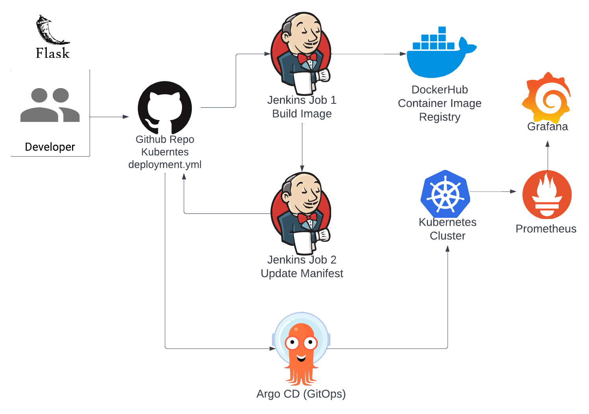

## Jenkins pipeline with GitOps(ArgoCD) to deploy code into a Kubernete. 

- CI - Jenkins 
- CD - ArgoCD (GitOps)

## Architectural Diagram
.

### [Manifest Repo](https://github.com/sanju2/manifest-repo)

### Used to follow the steps.

1. Create two repositories (buildimage, update manifest)

2. Install jenkins on ec2 and configure jenkins. Install docker & git on ec2

3. create jenkins 1 job - build image. select build image repo

4. create jenkins 2 job - update manifest. select update manifest rep0

5. Run build image job. See docker image is updated.

6. Create EKS Cluster. and update .kubeconfig file.

7. install argo cd using kubernetes. and login console.

8. create argo cd app. and configure github hook.

9. Setup Prometheus for Monitoring On Kubernetes Cluster.

## Screenshots

### EC2 Instance (Jenkins Server)
.

### Build Jenkins job
.

### Manifest Update Jenkins job
.

### Jenkins Home Page
.

### ArgoCD Dashboard
.

### Prometheus Dashboard
.

### Final Output
.

@Sanju2 :+1: Thank You! :shipit: